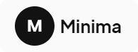

<h1 align="center">
    
</h1>

    <a href="#-tecnologias">Tecnologias</a>&nbsp;&nbsp;|&nbsp;&nbsp;
    <a href="#-projeto">Projeto</a>&nbsp;&nbsp;|&nbsp;&nbsp;
    <a href="#-layout">Layout</a>&nbsp;&nbsp;|&nbsp;&nbsp;
    <a href="#-features">Features extras</a>&nbsp;&nbsp;|&nbsp;&nbsp;
    <a href="#-licença">Licença</a>

    

    <kbd>
        
    </kbd>
    &nbsp;&nbsp;&nbsp;&nbsp;
    <kbd>
        
    </kbd>

## 🛠 Tecnologias

Esse projeto foi desenvolvido com as seguintes tecnologias:

- HTML
- CSS
- JavaScript

Bibliotecas

- [Google Fonts](https://fonts.google.com/)
- [SwiperJS](https://swiperjs.com/)
- [ScrollReveal](https://scrollrevealjs.org/)
- [Underscore.js](https://underscorejs.org/)

Utilitários

- [Font Awesome](https://fontawesome.com/)
- [Transfonter](https://transfonter.org/)
- [IconMoon](https://icomoon.io/)

## 💻 Projeto

O projeto **Minima** é um landing page, responsiva, criado a partir de um template do *Figma* elaborado para divulgar o serviço de uma empresa de design sobre mídias sociais. Possui as seguintes seções: Header, Navigataion, Home, Sobre, Serviços, História, Depoimentos, Equipe, Contato e Footer.
Acesse o site [clicando aqui](https://brendon3578.github.io/Minima/).

## 📷 Layout

O layout da aplicação está disponível no Figma:

## ☕ Features extras

Funcionalidades extras não extraidas do template.

- [x] Responsividade
- [x] Mudar estilo do header depois de rolar a Hero section
- [x] Animações de *Counting Up* presentes na Success Story section
- [x] Grid para responsividade presente na Our Team section e no Footer.

## 📝 Licença

Esse projeto está sob a licença MIT. Veja o arquivo [LICENSE](.github/LICENSE.md) para mais detalhes.

---

<h3 align="center">
    Feito com ☕ por <a href="https://github.com/Brendon3578">Brendon Gomes</a>
</h3>
